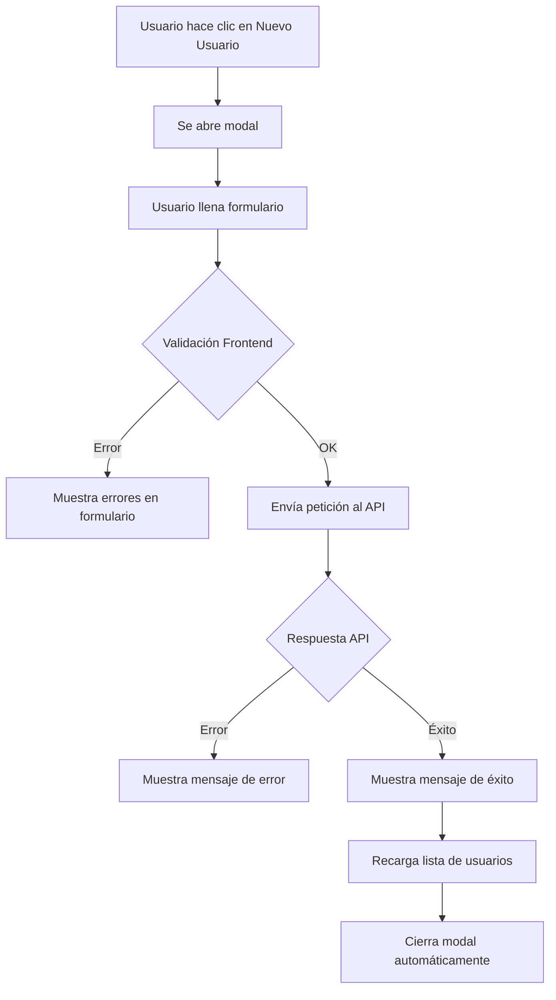

# 👥 Nueva Funcionalidad: Creación de Usuarios desde Panel SuperAdmin

## 📋 Resumen de Cambios

Se ha implementado un **modal completo** para crear nuevos usuarios desde el panel de administración ubicado en `http://localhost:3000/admin/usuarios`.

## ✨ Características Implementadas

### 1. **Modal de Creación de Usuario**
- ✅ Formulario completo con validación en tiempo real
- ✅ Diseño profesional y responsive
- ✅ Mensajes de error y éxito claros
- ✅ Integración con el API backend

### 2. **Campos del Formulario**

#### Información Personal:
- **Nombre** (obligatorio)
- **Apellido** (obligatorio)

#### Información de Cuenta:
- **Nombre de Usuario** (obligatorio, mínimo 4 caracteres)
- **Email** (obligatorio, formato válido)
- **Rol** (seleccionable entre):
  - Super Administrador (SUPERADMIN)
  - Administrador (ADMIN)
  - Usuario (USER)
  - Médico (MEDICO)
  - Enfermera (ENFERMERA)
  - Recepcionista (RECEPCIONISTA)

#### Contraseña:
- **Contraseña** (obligatorio, mínimo 6 caracteres)
- **Confirmar Contraseña** (debe coincidir)
- Botón para mostrar/ocultar contraseña

### 3. **Validaciones Implementadas**

```javascript
✅ Usuario: mínimo 4 caracteres
✅ Email: formato válido (ejemplo@dominio.com)
✅ Contraseña: mínimo 6 caracteres
✅ Confirmación de contraseña: debe coincidir
✅ Todos los campos requeridos marcados con *
```

### 4. **Integración con API**

El modal se conecta automáticamente con el backend en:
- **URL Base**: `http://localhost:8080/api`
- **Endpoint**: `POST /api/usuarios`
- **Autenticación**: Bearer Token (tomado del localStorage)

### 5. **Flujo de Trabajo**



## 🎨 Características de UI/UX

1. **Diseño Profesional**:
   - Gradientes verdes en el header del modal
   - Iconos descriptivos para cada sección
   - Animaciones suaves

2. **Feedback Visual**:
   - Loading spinner durante la creación
   - Mensajes de error en rojo
   - Mensajes de éxito en verde
   - Validación en tiempo real

3. **Responsive**:
   - Se adapta a móviles y tablets
   - Grid de 2 columnas en desktop
   - Scroll vertical en pantallas pequeñas

## 📝 Ejemplo de Uso

### 1. Abrir el Modal
```
1. Ve a: http://localhost:3000/admin/usuarios
2. Haz clic en el botón verde "Nuevo Usuario"
```

### 2. Llenar el Formulario
```javascript
{
  nombre: "Juan",
  apellido: "Pérez",
  username: "jperez",
  email: "juan.perez@cenate.com",
  rol: "MEDICO",
  password: "password123",
  confirmPassword: "password123"
}
```

### 3. Crear Usuario
```
1. Haz clic en "Crear Usuario"
2. Si hay errores, se mostrarán en rojo bajo cada campo
3. Si es exitoso, verás un mensaje verde
4. El modal se cierra automáticamente en 2 segundos
5. La lista de usuarios se actualiza automáticamente
```

## 🔒 Seguridad

- ✅ Validación de datos en frontend
- ✅ Token JWT requerido para autenticación
- ✅ Contraseñas nunca se muestran en texto plano por defecto
- ✅ Validación de formato de email
- ✅ Longitud mínima de contraseña

## 🐛 Manejo de Errores

El sistema maneja varios tipos de errores:

```javascript
❌ Usuario ya existe → "El usuario o email ya existe"
❌ Error de red → "Error al crear el usuario. Por favor intenta nuevamente."
❌ Sin token → "No autorizado"
❌ Validación fallida → Mensajes específicos por campo
```

## 📊 Actualización Automática de Estadísticas

Después de crear un usuario, se actualizan automáticamente:
- Total de usuarios
- Usuarios activos
- Usuarios con rol admin
- La tabla de usuarios

## 🎯 Funcionalidades Pendientes (Sugerencias)

Si deseas agregar más funcionalidades, podrías implementar:

1. **Editar Usuario**: Modal similar para editar usuarios existentes
2. **Eliminar Usuario**: Confirmación antes de eliminar
3. **Activar/Desactivar**: Toggle para cambiar estado de usuario
4. **Cambiar Contraseña**: Modal separado para cambio de contraseña
5. **Ver Detalles**: Modal con información completa del usuario
6. **Exportar Usuarios**: Descargar lista en CSV/Excel
7. **Importar Usuarios**: Cargar múltiples usuarios desde archivo

## 🔧 Dependencias Utilizadas

```json
{
  "axios": "^1.x.x",  // Para peticiones HTTP
  "react-icons": "^4.x.x"  // Para iconos
}
```

## ✅ Testing Recomendado

### Pruebas Manuales:
1. ✅ Crear usuario con datos válidos
2. ✅ Intentar crear usuario duplicado
3. ✅ Validar contraseñas no coinciden
4. ✅ Validar email inválido
5. ✅ Validar campos vacíos
6. ✅ Cerrar modal sin guardar
7. ✅ Verificar actualización de lista

### Pruebas del API:
```bash
# Test manual del endpoint
curl -X POST http://localhost:8080/api/usuarios \
  -H "Authorization: Bearer YOUR_TOKEN" \
  -H "Content-Type: application/json" \
  -d '{
    "username": "test_user",
    "email": "test@cenate.com",
    "password": "123456",
    "nombre": "Test",
    "apellido": "User",
    "rol": "USER"
  }'
```

## 📞 Soporte

Si encuentras algún problema:
1. Verifica que el backend esté corriendo en `http://localhost:8080`
2. Revisa que tengas un token válido en localStorage
3. Verifica los logs de la consola del navegador
4. Revisa los logs del backend

## 🎉 ¡Listo para Usar!

La funcionalidad está completamente implementada y lista para usar. Solo necesitas:
1. ✅ Reiniciar el frontend si está corriendo
2. ✅ Asegurarte de que el backend esté activo
3. ✅ Acceder a `http://localhost:3000/admin/usuarios`
4. ✅ ¡Crear tu primer usuario!

---

**Última actualización**: Octubre 24, 2025  
**Autor**: Claude (Asistente IA)  
**Versión**: 1.0.0
